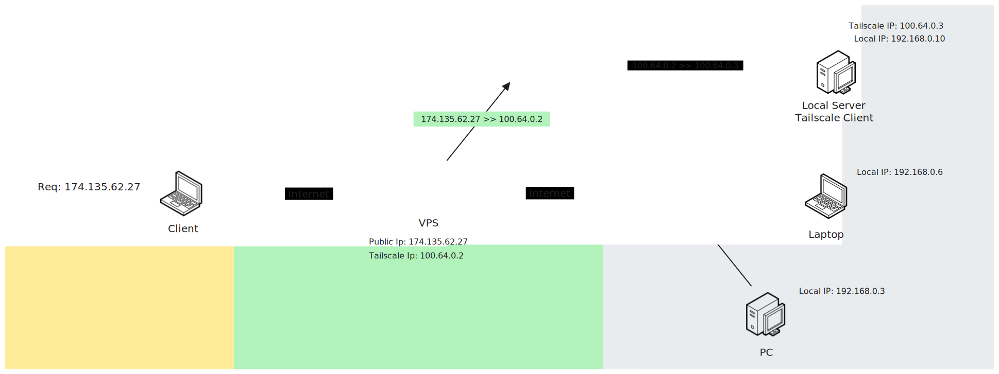

# Introducción

Esta documentación tiene como objetivo mostrar al usuario cómo configurar y ejecutar PechiNet de una forma sencilla y fácil. Este proyecto está basado en [Headscale](https://github.com/juanfont/headscale/blob/main/docs/running-headscale-container.md) y [Tailscale](https://tailscale.com/). 

>Nota: `Interface grafica en desarrollo.`

  
  
Esquema de la arquitectura de PechiNet.

## Beneficios de usar Pechinet

- **CERO CONFIGURACIÓN DE TU RED LOCAL.**
- **NO ES NECESARIO: ABRIR PUERTOS O TENER UNA IP PUBLICA EN TU DOMILICIO.**
- **FUNCIONA SI ESTAS CONECTADO A UNA RED MOVIL, WIFI O ETHERNET.**

## Requerimientos

- Tener conocimientos básicos en Linux, Docker, CLI y redes.
- Tener instalado Docker y Docker-Compose.
- Contar con una VPS, no importa el proveedor. ( Si no cuentas con una, puedes usar el plan gratis que ofrece [Oracle Cloud](https://www.oracle.com/cloud/free/) )
- Contar con una máquina local que quieras hacer pública por medio de PechiNet.

## Pasos a seguir

>Nota: ` Debes configurar el firewall de tu VPS para abrir los puertos que quieras usar o desactivarlo para hacer las pruebas.`
1. [**Configuración de la VPS**](/config_vps.md) 
2. [**Configuracion de la maquina local**](/config_local.md)
3. [**Redireccionamiento del tráfico de entrada de la VPS al Servidor Local**](/config_iptables.md)
